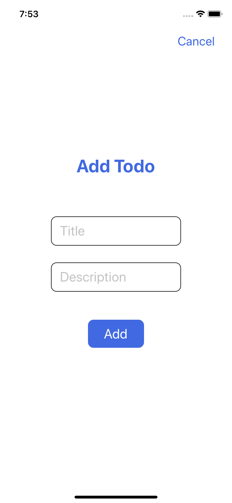

# はじめに

こちらは社内勉強会用に作成した、  
ReactNative(Expo)で超シンプルな Todo アプリを作るハンズオンになります。

TypeScript, ReactNative(Expo)の基礎をなんとなく学習し、  
興味を持ってもらったり、簡単なアプリなら作れるようになったりすることを目的としています。

検証が甘い部分があるため、気が向いたときに修正、追記していく予定です。  
また、間違っている部分や、より詳細な解説が必要な部分があれば issue 等でご報告頂ければ幸いです。

## React Native とは

- Facebook が作ったオープンソースのクロスプラットフォームフレームワーク
- iOS と Android を JavaScript(TypeScript)で同時開発できる
- 最近では、Web 対応進んでたり、Windows アプリ作れたりする

## Expo とは

- React Native の開発支援サービス
- Expo Client(スマホアプリ)や Expo Snack(Web)を使って開発できる
- Bluetooth や WebRTC、アプリ内課金等には、現状未対応

### Expo の使用について

基本的に使えるなら使うべきだと考えています。  
Windows 機で開発する場合でも、  
Expo Client を使って iPhone でデバッグできる等開発が楽になります。  
ただ、プロジェクトで Expo を辞める可能性が想定される場合は、  
Expo を使わず、@react-native-community/cli の使用をおすすめします。  
(eject 結構めんどくさいので)

# ToDo アプリを作ってみよう

レポジトリはこちら  
https://github.com/alternacrow/TodoApp

## デバッグについて

開発マシン上でのデバッグには、  
iOS は Xcode の iOS simulator、  
Android は Android Studio が必要になります。  
Expo を使用する場合には、Expo Client を使って、実機での確認が可能です。

## プロジェクト作成手順

### 1. プロジェクトの初期化

- expo-cli のインストール

公式ではグローバルインストールで記載されているが、  
プロジェクトで他の開発者と共有する場合は、プロジェクト内にローカルインストールして、  
バージョン固定するのが望ましいかも。

```
npm i -g expo-cli
```

- プロジェクト作成

```
expo-cli init TodoApp
```

- テンプレート選択

```
? Choose a template:
  ----- Managed workflow -----
❯ blank                 a minimal app as clean as an empty canvas
  blank (TypeScript)    same as blank but with TypeScript configuration
  tabs                  several example screens and tabs using react-navigation
  ----- Bare workflow -----
  minimal               bare and minimal, just the essentials to get you started
  minimal (TypeScript)  same as minimal but with TypeScript configuration
```

今回は `blank (TypeScript)` を選択

### 2. 起動してみよう

```
cd TodoApp
expo start
```

ブラウザかターミナルに出てきた QR コードをスマホのカメラで読み込もう。  
Expo Client が立ち上がって、実機でアプリを起動、動作確認出来る。  
コードを編集して保存すると、Expo 側でも変更を検知して反映してくれる。

## 画面構成

|  |  |
| :-----------------------------: | :-----------------------------------------------------------------------------------------------------------------------: |


## コーディング

今回はコンポーネント化やスタイリング等こだわらず、  
App.tsx の 1 ファイルで済ませます。

### 1. 画面作成

まずは、デザインを実装。  
List と Add(Modal)は Fragment で囲う。(空タグ<>でもおｋ)

- App を Functional Component に置き換え

```typescript
export default function App() {
```

->

```typescript
const App: FC = () => {
```

- 追加

<details><summary>import, export</summary><div>

```typescript
import React, { FC, Fragment } from "react";
import {
  StyleSheet,
  View,
  Text,
  TextInput,
  TouchableOpacity,
  Modal,
  SafeAreaView,
} from "react-native";
```

```typescript
export default App;
```

</div></details>

<details><summary>List</summary><div>

```react
<SafeAreaView style={styles.safearea}>
  <View style={styles.container}>
    <View style={styles.title_todo_list_container}>
      <Text style={styles.title_todo_list}>Todo List</Text>
    </View>
    <View style={styles.plus_button}>
      <TouchableOpacity>
        <Text style={styles.plus}>+</Text>
      </TouchableOpacity>
    </View>
    <View style={styles.todo_container}>
      <Text style={styles.todo_title}>todo 1</Text>
      <Text style={styles.todo_description}>description 1</Text>
    </View>
    <View style={styles.todo_container}>
      <Text style={styles.todo_title}>todo 2</Text>
      <Text style={styles.todo_description}>description 2</Text>
    </View>
    <View style={styles.todo_container}>
      <Text style={styles.todo_title}>todo 3</Text>
      <Text style={styles.todo_description}>description 3</Text>
    </View>
  </View>
</SafeAreaView>
```

</div></details>

<details><summary>Add</summary><div>

Modal コンポーネントの visible を true にすると表示される。

```react
<Modal visible={false} animationType={"slide"}>
  <View style={styles.modal}>
    <View style={styles.cancel_button}>
      <TouchableOpacity>
        <Text style={styles.cancel}>Cancel</Text>
      </TouchableOpacity>
    </View>
    <Text style={styles.title_add_todo}>Add Todo</Text>
    <View style={styles.textinput_frame}>
      <TextInput placeholder={"Title"} style={styles.textinput} />
    </View>
    <View style={styles.textinput_frame}>
      <TextInput placeholder={"Description"} style={styles.textinput} />
    </View>
    <View style={styles.add_button}>
      <TouchableOpacity>
        <Text style={styles.add}>Add</Text>
      </TouchableOpacity>
    </View>
  </View>
</Modal>
```

</div></details>

<details><summary>Style</summary><div>

```typescript
const styles = StyleSheet.create({
  safearea: {
    flex: 1,
  },
  container: {
    flex: 1,
  },
  modal: {
    flex: 1,
    alignItems: "center",
    justifyContent: "center",
  },
  title_todo_list_container: {
    alignItems: "center",
    paddingBottom: 20,
    borderBottomWidth: 1,
    borderColor: "gray",
  },
  title_todo_list: {
    fontSize: 32,
    fontWeight: "bold",
    color: "royalblue",
  },
  title_add_todo: {
    fontSize: 32,
    fontWeight: "bold",
    color: "royalblue",
    marginBottom: 40,
  },
  todo_container: {
    height: 90,
    justifyContent: "center",
    paddingHorizontal: 25,
    borderBottomWidth: 1,
    borderColor: "gray",
  },
  todo_title: {
    fontSize: 24,
  },
  todo_description: {
    fontSize: 16,
    marginTop: 5,
  },
  textinput_frame: {
    alignItems: "center",
    justifyContent: "center",
    paddingVertical: 5,
    padding: 15,
    borderWidth: 1,
    borderRadius: 10,
    marginTop: 30,
  },
  textinput: {
    width: 200,
    height: 40,
    fontSize: 24,
  },
  plus_button: {
    position: "absolute",
    alignItems: "center",
    justifyContent: "center",
    right: 30,
  },
  plus: {
    fontSize: 32,
    fontWeight: "bold",
    color: "royalblue",
  },
  cancel_button: {
    position: "absolute",
    top: 60,
    right: 30,
  },
  cancel: {
    fontSize: 22,
    color: "royalblue",
  },
  add_button: {
    width: 100,
    height: 50,
    alignItems: "center",
    justifyContent: "center",
    borderRadius: 10,
    backgroundColor: "royalblue",
    marginTop: 50,
  },
  add: {
    fontSize: 24,
    color: "white",
  },
});
```

</div></details>

#### react-native のコンポーネントの紹介

<details>
<summary>SafeAreaView</summary><div>
iOSのSafeAreaに対応するためのコンポーネント。
子コンポーネントを、SafeArea分の高さを考慮してレンダリングしてくれる。
Androidのステータスバー用には、StatusBarが用意されており、
`<SafeAreaView style={{ paddingTop: StatusBar.currentHeight }}  />`
で両プラットフォームに対応できる。
StatusBarは今回は使用してない。(忘れてた)
___
</div></details>

<details>
<summary>View</summary><div>
簡単に言えば、htmlタグのdiv。
___
</div></details>

<details>
<summary>TouchableOpacity</summary><div>
子コンポーネントにタッチイベントを付与できる。
styleを当てるときは、更にViewで囲い、View側にstyleを当てるのを推奨。
Androidだとborder周りのstyleが怪しかった記憶。(定かではない)
___
</div></details>

<details><summary>Modal</summary><div>
子コンポーネントをモーダル画面で表示できる。
___
</div></details>

<details>
<summary>TextInput</summary><div>
名前の通り、textをinputするためのコンポーネント。
___
</div></details>

<details>
<summary>StyleSheet</summary><div>
styleの外出しが出来る。
styled-components等のSassもあるので、お好みで。
___
</div></details>

### 2. Todo の State を追加

- Todo 型の宣言

Todo リストで使用する Todo 単体の型を定義する。

```typescript
type Todo = {
  id: number;
  title: string;
  description: string;
  done: boolean;
};
```

- Todo リストの State 追加

FC での state の宣言には、useState を使用する。

```typescript
import React, { FC, Fragment, useState, useEffect } from "react";
```

```typescript
const [todos, setTodos] = useState<Todo[]>([]);
```

`<Todo[]>`が state の型指定、args の`[]`は初期化の値。  
なので、todos は空の配列`[]`で初期化された`Todo`型の配列ということになる。  
また、setTodos は todos の値を変更するための関数。  
setTodos を使用して、todos の値が変更されると、  
その変更を検知して再レンダリングされる。

- Todo リストのサンプルデータ

```typescript
const SAMPLE_TODOS: Todo[] = [
  {
    id: 1,
    title: "todo 1",
    description: "description 1",
    done: false,
  },
  {
    id: 2,
    title: "todo 2",
    description: "description 2",
    done: false,
  },
  {
    id: 3,
    title: "todo 3",
    description: "description 3",
    done: false,
  },
];
```

- App コンポーネントのマウント後に、Todo リストのサンプルデータを todos に設定する

以前 React で使用していた、  
componentDidMount や componentWillUnmount 等は、  
FC では useEffect を使用する。

useEffect の第一引数には関数を、  
第二引数には処理タイミングを依存させる state 依存の値を配列で指定する。  
第二引数に指定した値に変更があるたび、useEffect 内の処理が走る。  
空配列指定した場合、componentDidMount のように、マウント後に処理が走るようになる。  
また、return で関数を返してあげるとアンマウント時に処理を走らせることができる。

今回は、API からサンプルデータ取ってきて、todos に設定するような気持ちで。

```typescript
useEffect(() => {
  setTodos(SAMPLE_TODOS);
}, []);
```

- Todo リストを Flatlist 化

配列データをリスト表記するのに特化したコンポーネント。  
漢書きした Todo リストを置き換えていく。

読み込み

```typescript
import {
  //...
  FlatList,
  //...
} from "react-native";
```

置換

```react
<View style={styles.todo_container}>
  <Text style={styles.todo_title}>todo 1</Text>
  <Text style={styles.todo_description}>description 1</Text>
</View>
<View style={styles.todo_container}>
  <Text style={styles.todo_title}>todo 2</Text>
  <Text style={styles.todo_description}>description 2</Text>
</View>
<View style={styles.todo_container}>
  <Text style={styles.todo_title}>todo 3</Text>
  <Text style={styles.todo_description}>description 3</Text>
</View>
```

->

```react
<FlatList
  data={todos}
  renderItem={({ item: todo }) => {
    return (
      <View style={styles.todo_container}>
        <Text numberOfLines={1} style={styles.todo_title}>
          {todo.title}
        </Text>
        <Text numberOfLines={1} style={styles.todo_description}>
          {todo.description}
        </Text>
      </View>
    );
  }}
  keyExtractor={(_, index) => index.toString()}
/>
```

data に表示したいデータ配列を渡し、renderItem で配列内のアイテムの表示を調整する。  
numberOfLines は、表示行数を設定できる Text コンポーネントの props。  
1 行を超える表示になりそうな場合、三点リーダーを使用した短縮表記になる。

### 3. [+]ボタンのイベントの追加

今回、画面の状態を、Todo リストモード、Todo 追加モードとして、管理することにする。  
[+]ボタンを押すと、state の mode が"add"に変更されるようにする。

- Mode 型の宣言

```typescript
type Mode = "list" | "add";
```

- Mode の State

```typescript
const [mode, setMode] = useState<Mode>("list");
```

- Mode を切り替える関数の追加

```typescript
const changeMode = (mode: Mode) => {
  setMode(mode);
};
```

- [+]ボタン用関数の追加

```typescript
const handlePlus = () => {
  changeMode("add");
};
```

- handlePlus の反映

```react
<TouchableOpacity onPress={() => handlePlus()}>
  <Text style={styles.plus}>+</Text>
</TouchableOpacity>
```

- Modal の props、visiable の修正

mode が"add"のときだけ、Todo 追加用画面(Modal)が表示されるようにする。

```react
<Modal visible={false} animationType={"slide"}>
```

→

```react
<Modal visible={mode === "add"} animationType={"slide"}>
```

### 4. Cancel ボタンのイベントの追加

押すと list 画面に戻るように、mode を"list"に切り替える処理の追加。

- Cancel ボタン用関数の追加

```typescript
const handleCancel = () => {
  changeMode("list");
};
```

- handleCancel の反映

```react
<TouchableOpacity onPress={() => handleCancel()}>
  <Text style={styles.cancel}>Cancel</Text>
</TouchableOpacity>
```

### 5. Todo 追加用 Title, Description の State の追加

TextInput で入力したテキストを保持するための state を追加する。

- 各 state の宣言

```typescript
const [title, setTitle] = useState("");
const [description, setDescription] = useState("");
```

- TextInput の修正

value には、表示するデータ、  
onChangeText には、入力後のテキストを state に設定する処理を追加する。

```react
<View style={styles.textinput_frame}>
  <TextInput
    placeholder={"Title"}
    value={title}
    onChangeText={text => setTitle(text)}
    style={styles.textinput}
  />
</View>
<View style={styles.textinput_frame}>
  <TextInput
    placeholder={"Description"}
    value={description}
    onChangeText={text => setDescription(text)}
    style={styles.textinput}
  />
</View>
```

### 6. Add ボタンのイベントの追加

title と description の state を使用して、  
新しい Todo を todos の末尾に追加する処理を追加する。

- Todo 追加用関数の追加

```typescript
const addTodo = (todo: Todo) => {
  setTodos((todos) => [...todos, todo]);
};
```

- Add ボタン用関数の追加

```typescript
const handleAdd = () => {
  // titleかdescriptionが空の場合は追加しない。
  if (!title || !description) return;

  // 追加するTodo
  const newTodo: Todo = {
    id: todos[todos.length - 1].id + 1,
    title,
    description,
    done: false,
  };
  addTodo(newTodo);

  // 追加後はListに戻る。
  changeMode("list");
};
```

- handleAdd の反映

```react
<TouchableOpacity onPress={() => handleAdd()}>
  <Text style={styles.add}>Add</Text>
</TouchableOpacity>
```

### 7. Add から List に戻った際に、TextInput から空になるように修正

今のままだと、新しい Todo 追加後に Todo 追加画面に遷移すると、  
Todo 追加時に入力していたテキストデータが残ってしまっているので、  
list 画面遷移時に title, description が空になるようにする。

- TextInput の初期化関数

```typescript
const resetInput = () => {
  setTitle("");
  setDescription("");
};
```

- List 遷移時に、初期化されるようにする。

今回は、useEffect を使用してみる。  
第二引数に[mode]を指定することで、mode の値が変更された場合に処理が走るようになる。  
第一引数では、mode が"list"の場合のみ resetInput が走るようにする。

```typescript
useEffect(() => {
  if (mode === "list") {
    resetInput();
  }
}, [mode]);
```

### 8. Delete ボタンの実装

[x]ボタンを押した際に、対象の Todo が削除されるように、  
タッチイベント処理を追加していく。

- Todo 削除用関数の追加

よくある方法で Todo の削除を実装する。  
useState で取得できる set 関数では、  
関数内で現在の state を取得することが出来る。  
（そもそもお互いが同じスコープで存在することの方が通常なので、  
あまりこういう書き方はしないかもしれない。お好みで。）  
現在の todos に filter をかけて、対象 id の todo 以外の todo 配列を設定する。

```typescript
const deleteTodo = (id: number) => {
  setTodos((todos) => todos.filter((todo) => todo.id !== id));
};
```

- Delete ボタン用関数の追加

```typescript
const handleDelete = (id: number) => {
  deleteTodo(id);
};
```

- handleDelete の反映と style の調整

```react
<Text numberOfLines={1} style={styles.todo_title}>
  {todo.title}
</Text>
<Text numberOfLines={1} style={styles.todo_description}>
  {todo.description}
</Text>
```

->

```react
<View style={styles.todo_container}>
  <Text numberOfLines={1} style={styles.todo_title}>
    {todo.title}
  </Text>
  <Text numberOfLines={1} style={styles.todo_description}>
    {todo.description}
  </Text>
</View>
<View style={styles.cross_button}>
  <TouchableOpacity onPress={() => handleDelete(todo.id)}>
    <Text style={styles.cross}>×</Text>
  </TouchableOpacity>
</View>
```

- Style 追加

```typescript
const styles = StyleSheet.create({
  //...
  todo_container: {
    flexDirection: "row",
    alignItems: "center",
    justifyContent: "space-between",
    height: 90,
    justifyContent: "center",
    paddingHorizontal: 25,
    borderBottomWidth: 1,
    borderColor: "gray",
  },
  //...
  cross_button: {
    alignItems: "center",
    justifyContent: "center",
  },
  cross: {
    fontSize: 32,
    color: "coral",
  },
});
```

### 9. Todo 初期化と Todo が空の場合のデザインの調整

- 初期化

追加

```typescript
const [ready, setReady] = useState(false);
```

```typescript
const getReady = () => {
  setTodos(SAMPLE_TODOS);

  setReady(true);
};
```

置換

```typescript
useEffect(() => {
  setTodos(SAMPLE_TODOS);
}, []);
```

→

```typescript
useEffect(() => {
  getReady();
}, []);
```

- 配列が空の場合のデザイン

ActivityIndicator コンポーネントは、  
よくローディングでくるくる回ってるやつ。  
ListEmptyComponent は、指定してあげると、  
data が空の場合の表示をカスタマイズできる。

```typescript
import {
  //...
  ActivityIndicator,
} from "react-native";
```

```react
{ready ? (
  <Flatlist
    //...
    ListEmptyComponent={() => (
      <View style={styles.empty_container}>
        <Text style={styles.empty}>Add Todo !!</Text>
      </View>
    )}
    //...
  />
) : (
  <View style={styles.loading_container}>
    <ActivityIndicator size={"large"} />
  </View>
)}
```

```typescript
const styles = StyleSheet.create({
  //...
  loading_container: {
    flex: 1,
    alignItems: "center",
    justifyContent: "center",
  },
  empty_container: {
    marginTop: 20,
    borderColor: "gray",
    alignItems: "center",
  },
  empty: {
    fontSize: 20,
    fontWeight: "400",
    color: "darkgray",
  },
  //...
});
```

以上
